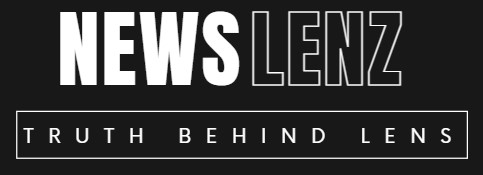
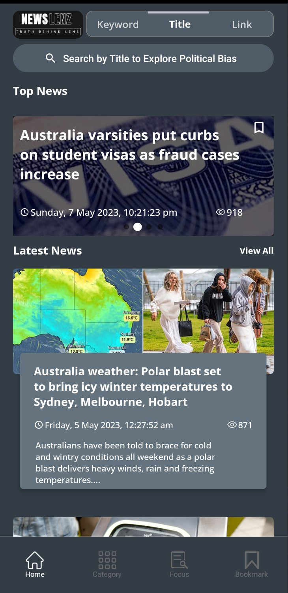
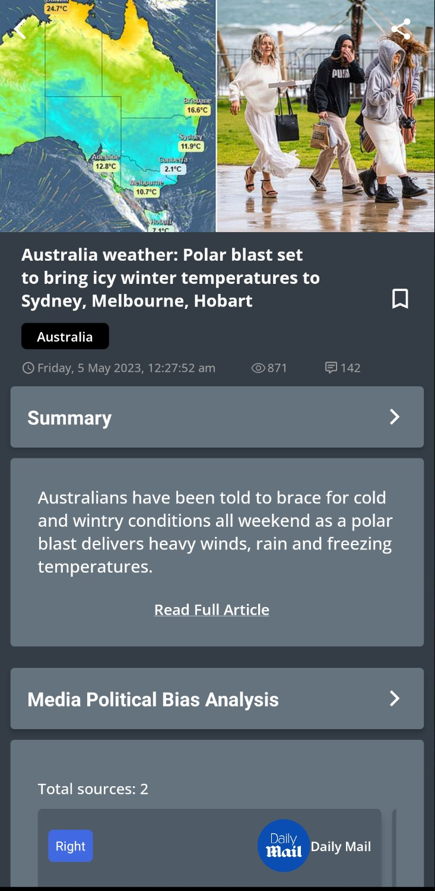
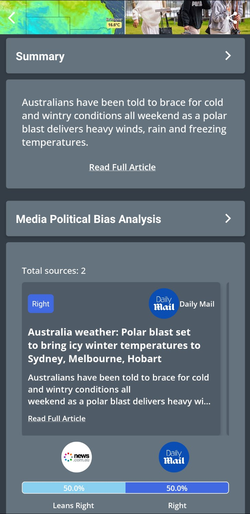
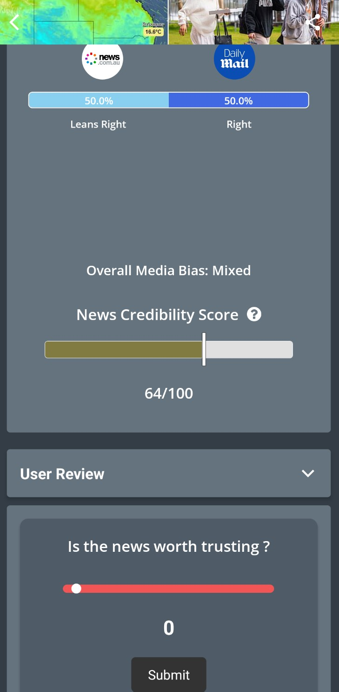
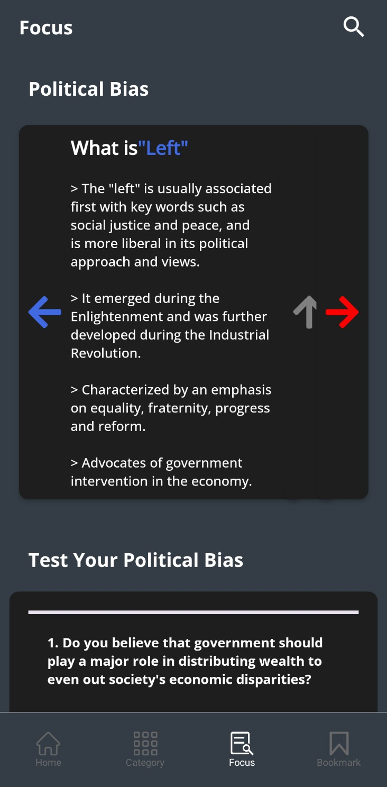

# NewsLens

<!-- PROJECT LOGO -->
<br />
<div align="center">
  <a href="https://github.com/github_username/repo_name">
    
  </a>

<h3 align="center">NewsLens</h3>

  <p align="center">
    React Native News App for Monash University Industrial Based Program
    <br />
    <br />
  </p>
</div>

<!-- TABLE OF CONTENTS -->
<details open>
  <summary>Table of Contents</summary>
  <ol>
    <li>
      <a href="#about-the-project">About The Project</a>
      <ul>
        <li><a href="#built-with">Built With</a></li>
      </ul>
    </li>
    <li>
      <a href="#getting-started">Getting Started</a>
      <ul>
        <li><a href="#prerequisites">Prerequisites</a></li>
        <li><a href="#installation">Installation</a></li>
      </ul>
    </li>
    <li><a href="#license">License</a></li>
    <li><a href="#credits">Credits</a></li>
  </ol>
</details>

<!-- ABOUT THE PROJECT -->
## About The Project

<p>Explore news with political bias.</p>
<p>Check news in different themes</p>
<p>Test your own political bias</p>
<p>Add your favourite news to your bookmarks.</p>

### Screenshots
<p float="left">
  
  
  
  
  
</p>

### Built With
<p>


</p>


<!-- GETTING STARTED -->
## Getting Started

### Prerequisites

* npm

  ```sh
  npm install -g yarn
  ```

### Installation

1. Get a free API Key at [https://newsapi.org/](https://newsapi.org/)

2. Clone the repo

   ```sh
   git clone https://github.com/wxin9monash/NewsLens.git
   ```
3. Install required packages

   ```sh
   npm install
   ```
   
4. Start the application

   ```js
   npx expo start
   ```

<!-- LICENSE -->
## License

Distributed under the [MIT](https://choosealicense.com/licenses/mit/) License.

